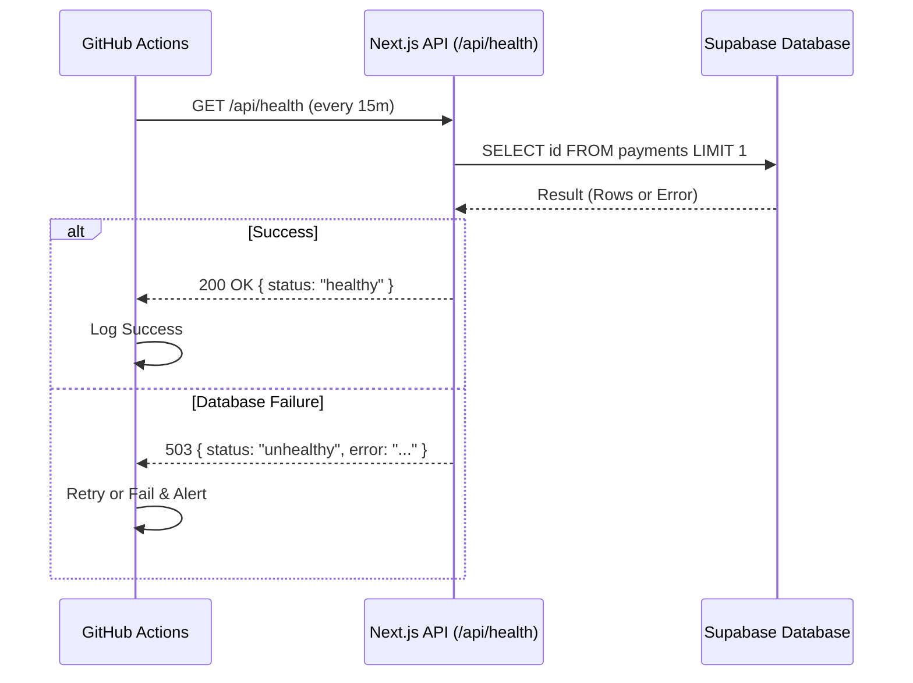

# Supabase Monitoring Architecture

This document describes the architectural design for Dovepeak Payments' Supabase project activity monitoring system.

## Overview

Supabase automatically pauses inactive projects to conserve resources on their free and basic tiers. An "inactive" project is defined as one that has not received database queries or API requests for a set period. 

To ensure high availability and prevent unexpected pauses for Dovepeak Payments, we have implemented an automated monitoring workflow that serves two purposes:
1. **Keeps the Supabase project active** through synthetic health checks.
2. **Validates service health** to ensure both the Next.js API and the Supabase Database are functioning correctly.

## Components

The architecture consists of three primary components:

### 1. The Application Health Endpoint (`/api/health`)
A dedicated Next.js API route that serves as the entry point for the synthetic checks.
- **Location:** `app/api/health/route.ts`
- **Method:** `GET`
- **Behavior:** 
  - The endpoint is marked with `dynamic = 'force-dynamic'` to prevent Next.js from caching the response.
  - It attempts a lightweight database operation (selecting `id` from `payments` with `limit(1)`) using the Supabase client.
  - It records the duration of the query.
  - It returns a standard JSON payload indicating `healthy` or `unhealthy` status.

### 2. Supabase Connection (`lib/supabase.ts`)
The endpoint utilizes the existing `supabase-js` client initialized with the anonymous key (`NEXT_PUBLIC_SUPABASE_ANON_KEY`).
- **Security:** We do not use the `service_role` key for health checks. This adheres to the principle of least privilege. Even if Row Level Security (RLS) policies prevent the anonymous key from reading data (returning 0 rows), the query execution itself is registered as database activity by Supabase and fulfills the requirement.

### 3. The Automation Engine (GitHub Actions)
A GitHub Actions workflow acts as the scheduler and test runner.
- **Location:** `.github/workflows/supabase-health-check.yml`
- **Schedule:** Executes every 15 minutes (`*/15 * * * *`).
- **Behavior:**
  - Uses an embedded JavaScript action (`github-script`) to `fetch()` the health endpoint.
  - Expects a `200 OK` and a `status: "healthy"` payload.
  - Implements a retry mechanism (3 attempts with 5-second delays) to recover from transient network blips.
  - Logs the full response for observability.

## Data Flow

## Security Considerations

1. **No Sensitive Data Exposure:** The `/api/health` endpoint does not return database records, user details, or connection strings. It only returns service metadata (version, duration) and generic error strings.
2. **Least Privilege:** The health check relies entirely on the anonymous key.
3. **DDoS Protection:** Because the query uses `.limit(1)` and targets an indexed ID, the computational cost on the database is negligible. Cloudflare or Next.js middleware rate limiting can be applied to `/api/health` if necessary to prevent abuse from external sources.
